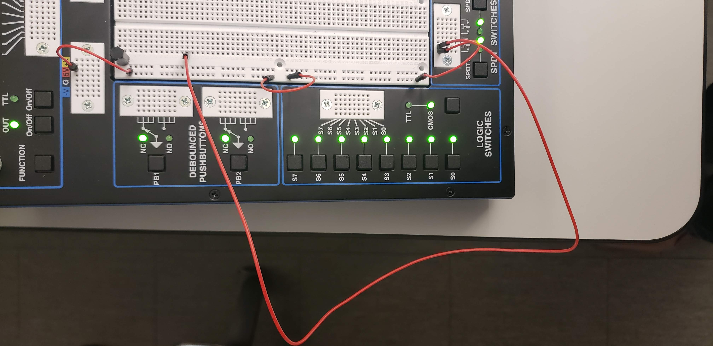

# CPE 1040 - Spring 2020

## Errata for Assignment 5

### Item 1.2

The [requirements](requirements.md#1-npn-transistor-circuit) state that the base resistor has to be connected to one of the logic switches on the left of the workstation, in the CMOS mode. In the CMOS mode, these switches output 1V in the on state, which is insufficient for the setup shown in the circuit sketch in the requirements.

#### Solution 1

Put the switch in the TTL mode (toggle the CMOS-TTL button). With the multimeter, make sure the output voltage in the on position (led is red) is 5V. If not, go to [solution 2](#solution-2).

#### Solution 2

Use the SPDT switches on the bottom as shown in the image below. Bring 5V over from the top, making sure to connect the two vertical halves of the rail.

If the image doesn't show, try following [this link](https://photos.app.goo.gl/V5FnHwSvj8XLRz489).

### Item 3.4

The [requirements](requirements.md#1-npn-transistor-circuit) state that a TTL switch should be used. The micro:bit runs at 3.3V so TTL, at 5V, is too high. A 3.3V input should be used.

#### Solution

1. Configure the yellow V+ input of the workstation to 3.3V. You can do that with the controls and console at the top of workstation. Alternatively, you can connect the multimeter to the black (GND) and yellow (V+) knobs at the top right, and adjust the voltage until the multimeter reads 3.3V.
2. Use the hookup from [item 1.2, solution 2](#solution-2) above, except take the voltage from V+ rather than 5V.
3. To use a workstation button as input to the micro:bit, the two devices need to have a common reference. Connect the two grounds: run a wire from the GND column of the workstation to the GND pin of the micro:bit. Now you will be able to read a high (logical 1) at the micro:bit pin with the 3.3V signal coming from the pressed SPDT button on the workstation, which is internally grounded. _Note: This connection of the grounds should not be used arbitrarily, without careful consideration of the two circuits. Large unintended currents may flow and damage the weaker device._
